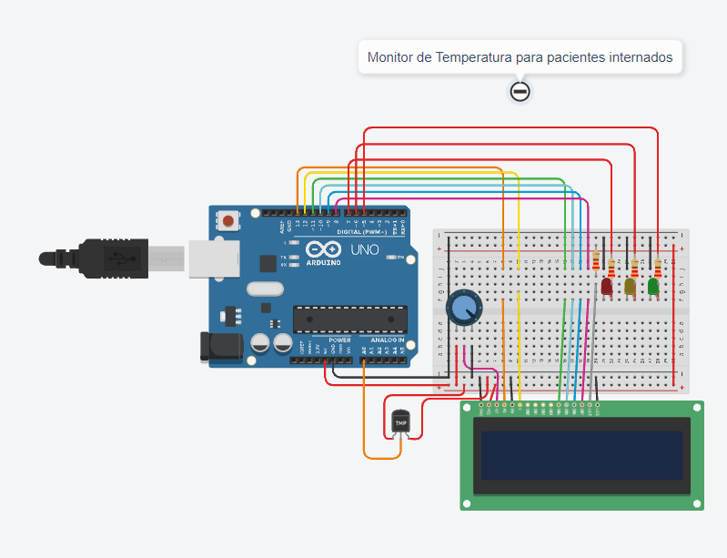

   
  <h1>Sensor de Monitoramento e Condições de Temperatura </h1>

 

<table>
  <tr>
    <td>
      

        <table>
          <tr>
            <th>Alunos:</th>
          </tr>
          <tr>
            <th>Beatriz Dantas Sampaio</th>
          </tr>
          <tr>
            <th>Lucas Bertolassi Iori</th>
          </tr>
        </table>

  

    </td>
    <td>
      

        <b>Global Solution   Edge Computing & Computer Systems</b>
      <td> <b>Objetivo →   Medir a temperatura em pacientes internados no hospital</b> </td>
      

    </td>
  </tr>
</table>

 

<h2> Hardware </h2>

<b> - Tabela com o hardware do circuito de medição de temperatura com o LDR </b>

| Quantidade | Descrição                     |
| ---------- | ----------------------------- |
| 1          | Arduino Uno R3                |
| 1          | Vermelho LED                  |
| 1          | Verde LED                     |
| 1          | Amarelo LED                   |
| 4          | 220 Ω Resistor                |
| 1          | Amarelo LED                   |
| 1          | Verde LED                     |
| -          | Jumpers                       |
| 1          | LCD 16x2                      |
| 1          | Sensor de Temperatura (TMP36) |
| 1          | Potenciômetro                 |

---

<h2> Configuração </h2>

Conecte os componentes elétricos de forma adequada, caso tenha dúvidas, consulte as imagens abaixo:
- <a href="CircuitoSensor.png"> Circuito completo </a>

<h2> Software </h2>

 Para o desenvolvimento do projeto, foi usado a IDE: 

<a href="https://www.arduino.cc/en/software"> Arduino IDE </a>

<h2> Links </h2>

Links úteis para tirar dúvidas: 
- <a href="CódigoSensor.c++"> Código do Sensor de Temperatura </a>

- <a href="Vídeo Circuito ‐ Feito com o Clipchamp.mp4"> Vídeo Explicativo </a>

- <a href="https://www.tinkercad.com/things/jUcdW5QDdIy-global-solution-sensor-de-temperatura/editel?returnTo=%2Fdashboard%3Ftype%3Dcircuits%26collection%3Ddesigns&sharecode=-NVC5FdnL1dPa8m1ZldBpTvBWM7Po3RJIQEUdx2sFCM"> Simulação no Tinkercad </a> 

<h2> Funcionamento  </h2>
1. Conecte os sensores e LEDs conforme o esquema.  
2. Conecte o Arduino.  
3. Carregue o código no Arduino usando a IDE.  
4. Observe as luzes dos LEDs e o LCD de acordo com as condições.  

 

⚠️ <b> Caso você use outras entradas para os componentes, favor lembrar de atualizar seu código com as entradas corretas. </b>
